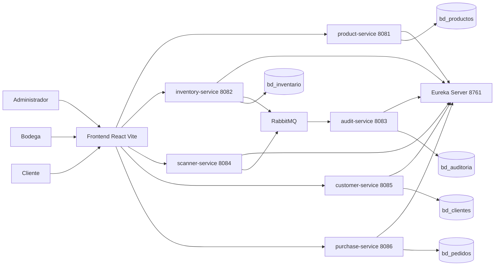
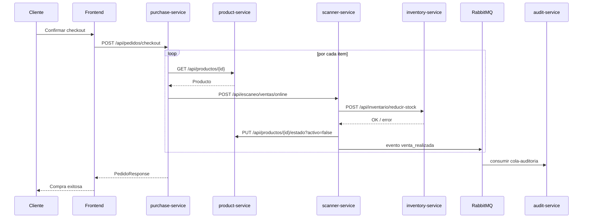

# Caminos Sostenibles Market

Proyecto de supermercado/ERP construido con arquitectura de microservicios en Spring Boot y un frontend en React. El sistema cubre tres frentes principales:

- Gestión administrativa de productos y ventas.
- Operación de bodega con registro de stock y escaneo por cámara/código de barras.
- Experiencia cliente para registro, login, catálogo, carrito y checkout.

La solución se apoya en descubrimiento de servicios con Eureka, comunicación HTTP entre servicios con OpenFeign, persistencia en MySQL y auditoría asíncrona con RabbitMQ.

## 1. Visión General

El repositorio es un monorepo con:

- Un `pom.xml` raíz que orquesta los microservicios backend.
- Varios servicios Spring Boot, cada uno con responsabilidad delimitada.
- Un frontend React/Vite que consume los servicios por medio de proxy local.

Capacidades principales del sistema:

- CRUD de productos.
- Activación y desactivación de productos según disponibilidad.
- Control de inventario por lotes.
- Descuento de stock con lógica FIFO.
- Escaneo de códigos de barras desde navegador/celular.
- Registro e inicio de sesión de clientes.
- Checkout de pedidos online.
- Consulta de pedidos del cliente y ventas recientes para administración.
- Auditoría de eventos relevantes del dominio.

## 2. Arquitectura General

### 2.1 Servicios y puertos

| Módulo | Puerto | Rol principal |
|---|---:|---|
| `eureka-server` | 8761 | Registro y descubrimiento de microservicios |
| `product-service` | 8081 | Catálogo y administración de productos |
| `inventory-service` | 8082 | Existencias, lotes, reducción y alta de stock |
| `audit-service` | 8083 | Persistencia y consulta de eventos de auditoría |
| `scanner-service` | 8084 | Escaneo físico y ventas online con ajuste de stock |
| `customer-service` | 8085 | Registro, login y perfil de cliente |
| `purchase-service` | 8086 | Checkout y consulta de pedidos |
| `frontend` | 5173 | Interfaz web para administrador, bodega y cliente |

### 2.2 Relación entre servicios

Flujo simplificado:

1. `product-service` administra el catálogo maestro de productos.
2. `inventory-service` registra lotes y existencias por producto.
3. `scanner-service` recibe ventas físicas por código de barras y ventas online por ID de producto.
4. `purchase-service` ejecuta checkout; para cada ítem delega la salida de stock a `scanner-service`.
5. `inventory-service` y `scanner-service` publican eventos a RabbitMQ.
6. `audit-service` consume esos mensajes y los persiste.
7. `frontend` consume todos esos servicios por medio de rutas `/api/...` proxificadas por Vite.

### 2.2.1 Diagrama de alto nivel



### 2.2.2 Diagrama del flujo de compra online



### 2.3 Decisiones técnicas importantes

- El catálogo y el inventario están separados: un producto existe aunque no tenga stock.
- El estado `activo` del producto se usa para disponibilidad comercial.
- La reducción de stock se hace por lotes y usando FIFO.
- La auditoría es asíncrona: una venta o ajuste de stock puede completarse aunque la auditoría falle temporalmente.
- El frontend trabaja con rutas relativas `/api/...` para evitar problemas de CORS y facilitar acceso desde celular durante desarrollo.

## 3. Estructura del Repositorio

```text
.
├── pom.xml
├── README.md
├── eureka-server/
├── product-service/
├── inventory-service/
├── scanner-service/
├── audit-service/
├── customer-service/
├── purchase-service/
└── frontend/
```

### 3.1 `pom.xml` raíz

Es un agregador Maven multi-módulo. Declara:

- `spring-boot-starter-parent` 3.2.0
- `java.version` 17
- `spring-cloud.version` 2023.0.0
- Los módulos del sistema

Módulos declarados actualmente:

- `eureka-server`
- `product-service`
- `inventory-service`
- `scanner-service`
- `audit-service`
- `customer-service`
- `purchase-service`

## 4. Stack Tecnológico

### Backend

- Java 17
- Spring Boot 3.2.0
- Spring Web
- Spring Data JPA
- Spring Cloud Netflix Eureka
- Spring Cloud OpenFeign
- Spring AMQP / RabbitMQ
- Hibernate
- MySQL 8
- Maven

### Frontend

- React
- React Router
- Vite
- GSAP
- html5-qrcode
- CSS plano centralizado en `src/index.css`

### Infraestructura y soporte

- RabbitMQ local para auditoría asíncrona
- Base de datos MySQL externa
- Vite proxy para desarrollo local
- LocalTunnel/Cloudflare Tunnel para pruebas móviles si hace falta exponer el frontend

## 5. Bases de Datos

Cada servicio con persistencia mantiene su propia base de datos, siguiendo el principio de ownership por servicio.

| Base de datos | Servicio |
|---|---|
| `bd_productos` | `product-service` |
| `bd_inventario` | `inventory-service` |
| `bd_auditoria` | `audit-service` |
| `bd_clientes` | `customer-service` |
| `bd_pedidos` | `purchase-service` |

Notas:

- `scanner-service` no mantiene base propia en el estado actual; orquesta otros servicios.
- `eureka-server` tampoco persiste dominio de negocio.

## 6. Seguridad y Configuración

El repositorio contiene configuración directa en archivos `application.properties`. Para un entorno real, esto debe endurecerse.

Recomendaciones:

- Mover credenciales y URLs sensibles a variables de entorno o perfiles externos.
- No documentar ni versionar secretos reales en el README.
- Mantener RabbitMQ, MySQL y URLs de infraestructura parametrizados por entorno.
- Considerar autenticación real con tokens para el portal cliente si el proyecto evoluciona a producción.

## 7. Requisitos Previos

### Backend

- JDK 17 configurado o una versión compatible con el proyecto.
- Maven instalado.
- RabbitMQ corriendo en `localhost:5672`.
- Acceso a la base MySQL configurada en los `application.properties`.

### Frontend

- Node.js y npm.
- Dependencias instaladas con `npm install` dentro de `frontend/`.

### Desarrollo móvil o escaneo por cámara

- Navegador con soporte de cámara.
- En iPhone/Safari, acceso por contexto seguro si la cámara lo exige.
- Si se accede desde otra red/dispositivo, puede ser útil usar `npm run tunnel`.

## 8. Instalación por Sistema Operativo

Esta sección describe cómo preparar un entorno de desarrollo desde cero. Los pasos exactos pueden variar según la versión del sistema operativo, pero esta guía cubre el escenario más común.

### 8.1 macOS

Herramientas recomendadas:

- Homebrew
- JDK 17
- Maven
- Node.js LTS
- RabbitMQ

Instalación sugerida:

```bash
# Homebrew (si no existe)
/bin/bash -c "$(curl -fsSL https://raw.githubusercontent.com/Homebrew/install/HEAD/install.sh)"

# Java 17
brew install openjdk@17

# Maven
brew install maven

# Node.js LTS
brew install node

# RabbitMQ
brew install rabbitmq
brew services start rabbitmq
```

Verificaciones útiles:

```bash
java -version
mvn -version
node -v
npm -v
rabbitmqctl status
```

Notas:

- Si tu terminal usa otra versión de Java por defecto, exporta `JAVA_HOME` apuntando al JDK 17.
- Si RabbitMQ ya estaba instalado, `brew services restart rabbitmq` suele bastar.

### 8.2 Windows

Herramientas recomendadas:

- JDK 17
- Maven
- Node.js LTS
- RabbitMQ Server
- Git Bash o PowerShell

Instalación sugerida:

1. Instalar JDK 17 desde Adoptium o una distribución equivalente.
2. Instalar Maven y agregarlo al `PATH`.
3. Instalar Node.js LTS.
4. Instalar RabbitMQ y Erlang.
5. Verificar variables de entorno `JAVA_HOME` y `PATH`.

Verificaciones útiles en PowerShell:

```powershell
java -version
mvn -version
node -v
npm -v
rabbitmqctl status
```

Notas:

- RabbitMQ en Windows requiere Erlang instalado previamente o incluido según el instalador usado.
- Si `mvn` no responde, casi siempre es un problema de `PATH`.

### 8.3 Linux

Paquetes base habituales:

- OpenJDK 17
- Maven
- Node.js LTS
- npm
- RabbitMQ

Ejemplo para Debian/Ubuntu:

```bash
sudo apt update
sudo apt install -y openjdk-17-jdk maven nodejs npm rabbitmq-server
sudo systemctl enable rabbitmq-server
sudo systemctl start rabbitmq-server
```

Verificaciones útiles:

```bash
java -version
mvn -version
node -v
npm -v
sudo rabbitmqctl status
```

Notas:

- En algunas distribuciones conviene instalar Node.js desde `nvm` o repositorios oficiales si el paquete del sistema está muy desactualizado.
- Si usas firewall local, asegúrate de no bloquear puertos relevantes en tus pruebas.

## 9. Cómo Levantar el Proyecto

## 9.1 Orden recomendado de arranque

1. RabbitMQ.
2. `eureka-server`.
3. Servicios de dominio backend.
4. Frontend.

## 9.2 Comandos backend

Desde la raíz del proyecto:

```bash
# Eureka
mvn spring-boot:run -pl eureka-server

# Productos
mvn spring-boot:run -pl product-service

# Inventario
mvn spring-boot:run -pl inventory-service

# Auditoría
mvn spring-boot:run -pl audit-service

# Escáner
mvn spring-boot:run -pl scanner-service

# Clientes
mvn spring-boot:run -pl customer-service

# Compras / pedidos
mvn spring-boot:run -pl purchase-service
```

## 9.3 Frontend

Desde `frontend/`:

```bash
npm install
npm run dev
```

Opcionales:

```bash
npm run build
npm run preview
npm run tunnel
```

## 9.4 Build general

Desde la raíz:

```bash
mvn clean install
```

## 10. Frontend: Qué Hace y Cómo Entenderlo

El frontend concentra tres experiencias de usuario:

- Administrador.
- Bodega.
- Cliente final.

### 10.1 Enrutamiento principal

Rutas principales:

- `/admin`
- `/bodega`
- `/cliente/auth`
- `/cliente/catalogo`
- `/cliente/carrito`
- `/cliente/checkout`
- `/cliente/compra-exitosa`
- `/cliente/pedidos`
- `/cliente/cuenta`

### 10.2 Archivos importantes del frontend

| Ruta | Propósito |
|---|---|
| `frontend/src/main.jsx` | Bootstrap React y definición de rutas |
| `frontend/src/App.jsx` | Shell principal de admin/bodega |
| `frontend/src/pages/AdministradorPage.jsx` | Vista administrativa |
| `frontend/src/pages/BodegaPage.jsx` | Flujo de escaneo y stock |
| `frontend/src/pages/ClientePage.jsx` | Layout y subpáginas del portal cliente |
| `frontend/src/api/administradorApi.js` | Cliente HTTP para productos, inventario, escaneo y ventas recientes |
| `frontend/src/api/clienteApi.js` | Cliente HTTP para autenticación, perfil y pedidos |
| `frontend/src/components/bodega/LectorCodigoBarras.jsx` | Escaneo con cámara usando `html5-qrcode` |
| `frontend/src/components/productos/*` | Formularios y tabla del catálogo |
| `frontend/src/components/inventario/*` | Stock, existencias y lotes |
| `frontend/src/index.css` | Estilos globales de toda la UI |

### 10.3 Proxy de desarrollo

`frontend/vite.config.js` enruta localmente:

- `/api/productos` -> `http://127.0.0.1:8081`
- `/api/inventario` -> `http://127.0.0.1:8082`
- `/api/escaneo` -> `http://127.0.0.1:8084`
- `/api/clientes` -> `http://127.0.0.1:8085`
- `/api/pedidos` -> `http://127.0.0.1:8086`

Eso permite que el frontend haga `fetch('/api/...')` sin conocer URLs absolutas durante desarrollo.

### 10.4 Experiencia de Administrador

La vista administrativa agrupa funciones de catálogo y consulta de ventas.

Responsabilidades principales:

- Listar productos.
- Buscar productos por nombre.
- Crear productos.
- Editar productos.
- Cambiar estado activo/inactivo.
- Consultar ventas recientes mediante `purchase-service`.

### 10.5 Experiencia de Bodega

La vista de bodega está orientada a operación física.

Responsabilidades principales:

- Escanear código de barras desde cámara.
- Buscar productos.
- Registrar stock por lote.
- Consultar existencias.
- Editar productos existentes.

El componente `LectorCodigoBarras` usa `html5-qrcode` y puede requerir HTTPS o túnel en ciertos dispositivos móviles.

### 10.6 Experiencia de Cliente

El portal cliente está centralizado en `ClientePage.jsx` y contiene varias subpáginas exportadas en el mismo archivo.

Subpáginas actuales:

- `ClienteAuthPage`
- `ClienteCatalogoPage`
- `ClienteCarritoPage`
- `ClienteCheckoutPage`
- `ClienteCompraExitosaPage`
- `ClientePedidosPage`
- `ClientePerfilPage`

Responsabilidades del portal cliente:

- Registro e inicio de sesión.
- Persistencia de sesión y carrito en navegador.
- Navegación de catálogo.
- Agregado y retiro de productos en carrito.
- Checkout.
- Historial de pedidos.
- Edición de perfil.

## 11. Backend: Cómo Entender Cada Servicio

Cada microservicio sigue un patrón bastante consistente:

1. `controller/` expone HTTP.
2. `service/` implementa reglas de negocio.
3. `repository/` accede a base de datos.
4. `entity/` representa el modelo persistente.
5. `dto/` aparece donde el servicio necesita contratos explícitos de entrada/salida.
6. `client/` aparece cuando un servicio llama a otro por Feign.
7. `configuracion/` agrupa piezas de soporte como RabbitMQ.

Si alguien nuevo entra al proyecto, la ruta mental correcta es:

1. Leer el controller.
2. Ver qué método del service invoca.
3. Revisar qué entidades y repositorios toca.
4. Confirmar si publica eventos o llama a otros microservicios.

## 12. Servicio por Servicio

## 12.1 `eureka-server`

Responsabilidad:

- Registrar y descubrir microservicios.

Qué mirar para entenderlo:

- `application.properties` para configuración base.
- La clase `EurekaServerApplication` para el arranque del servidor.

Notas:

- No maneja dominio de negocio.
- Debe iniciar antes que los servicios que se registran.

## 12.2 `product-service`

Responsabilidad:

- Mantener el catálogo maestro de productos.

Estructura relevante:

- `controller/ProductoController.java`
- `service/ProductoService.java`
- `entity/Producto.java`
- `repository/ProductoRepository.java`

Qué hace:

- Lista todos los productos.
- Obtiene producto por ID.
- Busca por código de barras.
- Busca por nombre.
- Crea productos.
- Actualiza atributos del producto.
- Cambia el estado activo/inactivo.
- Elimina productos.

Detalle importante de negocio:

- Cuando se crea un producto y no se especifica `activo`, el servicio lo inicializa en `false`.
- `scanner-service` puede desactivar automáticamente un producto si el stock llega a cero.

Endpoints:

- `GET /api/productos`
- `GET /api/productos/{id}`
- `GET /api/productos/codigo/{codigo}`
- `GET /api/productos/buscar?nombre=...`
- `POST /api/productos`
- `PUT /api/productos/{id}`
- `PUT /api/productos/{id}/estado?activo=true|false`
- `DELETE /api/productos/{id}`

## 12.3 `inventory-service`

Responsabilidad:

- Llevar las existencias y los lotes por producto.

Estructura relevante:

- `controller/InventarioController.java`
- `service/InventarioService.java`
- `entity/ExistenciaProducto.java`
- `entity/Lote.java`
- `repository/ExistenciaProductoRepository.java`
- `repository/LoteRepository.java`
- `configuracion/ConfiguracionRabbitMQ.java`

Qué hace:

- Consulta existencias globales o por producto.
- Consulta lotes por producto.
- Registra nuevos lotes y suma existencias.
- Reduce stock.
- Lista lotes próximos a vencer.

Regla de negocio clave:

- La reducción de stock usa FIFO: descuenta primero de los lotes más antiguos.

Integración con auditoría:

- Publica mensajes en `cola-auditoria` al crear lotes.
- Publica mensajes en `cola-auditoria` al reducir inventario.

Endpoints:

- `GET /api/inventario/existencias`
- `GET /api/inventario/existencias/{idProducto}`
- `GET /api/inventario/lotes/{idProducto}`
- `POST /api/inventario/agregar-stock?idProducto=...&numeroLote=...&cantidad=...&fechaVencimiento=YYYY-MM-DD`
- `POST /api/inventario/reducir-stock?idProducto=...&cantidad=...`
- `GET /api/inventario/lotes-por-vencer?fechaLimite=YYYY-MM-DD`

## 12.4 `scanner-service`

Responsabilidad:

- Ser la capa operativa para ventas disparadas por escaneo físico y para ventas online que necesitan afectar inventario.

Estructura relevante:

- `controller/EscaneoController.java`
- `service/EscaneoService.java`
- `client/ClienteInventario.java`
- `client/ClienteProductos.java`
- `configuracion/ConfiguracionRabbitMQ.java`

Qué hace:

- Recibe un código de barras y una operación.
- Busca el producto por código en `product-service`.
- Si la operación es venta, reduce stock en `inventory-service`.
- Si el stock queda en cero, intenta desactivar el producto en `product-service`.
- Publica evento de auditoría.
- Atiende ventas online por `idProducto`, sin pasar por código de barras.

Endpoints:

- `POST /api/escaneo?codigoBarras=...&operacion=venta&cantidad=...`
- `POST /api/escaneo/ventas/online?idProducto=...&cantidad=...`

Detalle importante:

- La venta puede completarse aunque falle la sincronización de estado activo/inactivo del producto; esa falla no revierte la salida de stock.

## 12.5 `audit-service`

Responsabilidad:

- Registrar y consultar eventos de auditoría del sistema.

Estructura relevante:

- `controller/EventoAuditoriaController.java`
- `service/EventoAuditoriaService.java`
- `entity/EventoAuditoria.java`
- `repository/EventoAuditoriaRepository.java`
- `configuracion/ConfiguracionRabbitMQ.java`

Qué hace:

- Expone consultas de eventos.
- Escucha la cola RabbitMQ `cola-auditoria`.
- Convierte mensajes con formato `tipoEvento:idAgregado:contenido` en entidades persistidas.

Endpoints:

- `GET /api/auditoria/eventos`
- `GET /api/auditoria/eventos/agregado/{idAgregado}`
- `GET /api/auditoria/eventos/tipo/{tipoEvento}`

## 12.6 `customer-service`

Responsabilidad:

- Gestionar la identidad básica del cliente.

Estructura relevante:

- `controller/ClienteController.java`
- `service/ClienteService.java`
- `entity/Cliente.java`
- `dto/*`
- `repository/ClienteRepository.java`

Qué hace:

- Registro de cliente.
- Inicio de sesión.
- Consulta por ID.
- Actualización de perfil.

Reglas de negocio:

- El email se normaliza a minúsculas.
- La contraseña se almacena con `BCryptPasswordEncoder`.
- Un cliente inactivo no puede iniciar sesión.

Endpoints:

- `POST /api/clientes/registro`
- `POST /api/clientes/login`
- `GET /api/clientes/{idCliente}`
- `PUT /api/clientes/{idCliente}`

## 12.7 `purchase-service`

Responsabilidad:

- Modelar y persistir pedidos del canal online.

Estructura relevante:

- `controller/PedidoController.java`
- `service/PedidoService.java`
- `entity/Pedido.java`
- `entity/PedidoItem.java`
- `dto/*`
- `client/ClienteProductos.java`
- `client/ClienteEscaneo.java`
- `repository/PedidoRepository.java`

Qué hace:

- Recibe el checkout del cliente.
- Valida que cada producto exista y esté activo.
- Para cada ítem delega la venta online a `scanner-service`.
- Calcula subtotales y total.
- Genera una referencia de pago simulada.
- Persiste el pedido con estado `PAGADO`.
- Lista pedidos por cliente.
- Lista todos los pedidos para el panel administrativo.

Endpoints:

- `POST /api/pedidos/checkout`
- `GET /api/pedidos/cliente/{idCliente}`
- `GET /api/pedidos`

Detalle importante:

- `purchase-service` no descuenta inventario directamente; usa `scanner-service` como punto de entrada de la salida de stock.

## 13. Flujos de Negocio Importantes

## 13.1 Alta de producto

1. Admin crea un producto en `product-service`.
2. El producto queda disponible en catálogo de administración.
3. Si no se marca activo, el backend lo deja inactivo por defecto.

## 13.2 Ingreso de stock

1. Bodega identifica el producto.
2. Registra lote, cantidad y fecha de vencimiento.
3. `inventory-service` crea el lote.
4. Actualiza la existencia acumulada del producto.
5. Publica evento `lote_creado` en RabbitMQ.
6. `audit-service` lo persiste.

## 13.3 Venta física por escaneo

1. Bodega escanea código de barras.
2. `scanner-service` consulta el producto por código.
3. `inventory-service` reduce stock con FIFO.
4. `scanner-service` valida si el stock llegó a cero.
5. Si corresponde, desactiva el producto en `product-service`.
6. Publica `venta_realizada` en auditoría.

## 13.4 Compra online

1. Cliente inicia sesión y arma carrito.
2. Frontend envía checkout a `purchase-service`.
3. `purchase-service` valida cada producto contra `product-service`.
4. `purchase-service` llama a `scanner-service` para cada venta online.
5. `scanner-service` reduce inventario y emite auditoría.
6. `purchase-service` persiste el pedido con detalle de ítems.
7. Frontend muestra la compra exitosa y el historial queda disponible.

## 14. Cómo Navegar el Código Rápidamente

Si quieres entender una funcionalidad específica, esta es la mejor ruta de lectura:

### Ver catálogo o producto

1. `frontend/src/api/administradorApi.js`
2. `product-service/controller/ProductoController.java`
3. `product-service/service/ProductoService.java`

### Ver stock y lotes

1. `frontend/src/components/inventario/*`
2. `inventory-service/controller/InventarioController.java`
3. `inventory-service/service/InventarioService.java`

### Ver escaneo por cámara

1. `frontend/src/components/bodega/LectorCodigoBarras.jsx`
2. `scanner-service/controller/EscaneoController.java`
3. `scanner-service/service/EscaneoService.java`

### Ver login y perfil cliente

1. `frontend/src/api/clienteApi.js`
2. `frontend/src/pages/ClientePage.jsx`
3. `customer-service/controller/ClienteController.java`
4. `customer-service/service/ClienteService.java`

### Ver checkout y pedidos

1. `frontend/src/pages/ClientePage.jsx`
2. `frontend/src/api/clienteApi.js`
3. `purchase-service/controller/PedidoController.java`
4. `purchase-service/service/PedidoService.java`

### Ver auditoría

1. Buscar `convertAndSend("cola-auditoria", ...)` en productores.
2. Revisar `audit-service/service/EventoAuditoriaService.java`.

## 15. Convenciones de Organización

Patrones observables en el repositorio:

- Un microservicio por responsabilidad de negocio.
- Base de datos propia por servicio persistente.
- Controladores delgados y lógica en `service/`.
- Feign clients para comunicación HTTP entre servicios.
- Cola RabbitMQ compartida para trazabilidad asíncrona.
- Frontend con `fetch` simple, sin capa de estado global externa.
- CSS centralizado en un único archivo grande (`index.css`).

## 16. Ejemplos de Requests y Responses

Los siguientes ejemplos buscan acelerar pruebas manuales y comprensión del contrato HTTP. Los campos exactos pueden variar si el modelo evoluciona, pero reflejan la intención actual del sistema.

### 16.1 `product-service`

#### Crear producto

Request:

```http
POST /api/productos
Content-Type: application/json

{
	"codigoProducto": "7701234567890",
	"nombreProducto": "Cafe Organico 500g",
	"descripcionProducto": "Cafe tostado molido",
	"categoriaProducto": "Bebidas",
	"precioProducto": 18500,
	"unidadMedida": "unidad",
	"imagenUrl": "https://ejemplo.com/cafe.png",
	"activo": true
}
```

Response esperada:

```json
{
	"idProducto": 1,
	"codigoProducto": "7701234567890",
	"nombreProducto": "Cafe Organico 500g",
	"descripcionProducto": "Cafe tostado molido",
	"categoriaProducto": "Bebidas",
	"precioProducto": 18500,
	"unidadMedida": "unidad",
	"imagenUrl": "https://ejemplo.com/cafe.png",
	"activo": true
}
```

#### Buscar por nombre

Request:

```http
GET /api/productos/buscar?nombre=cafe
```

Response esperada:

```json
[
	{
		"idProducto": 1,
		"codigoProducto": "7701234567890",
		"nombreProducto": "Cafe Organico 500g",
		"categoriaProducto": "Bebidas",
		"precioProducto": 18500,
		"activo": true
	}
]
```

#### Cambiar estado

Request:

```http
PUT /api/productos/1/estado?activo=false
```

Response esperada:

```json
{
	"idProducto": 1,
	"activo": false
}
```

### 16.2 `inventory-service`

#### Registrar stock

Request:

```http
POST /api/inventario/agregar-stock?idProducto=1&numeroLote=L001&cantidad=25&fechaVencimiento=2026-12-31
```

Response esperada:

```json
{
	"id": 1,
	"idProducto": 1,
	"cantidadTotal": 25
}
```

#### Consultar existencia

Request:

```http
GET /api/inventario/existencias/1
```

Response esperada:

```json
{
	"id": 1,
	"idProducto": 1,
	"cantidadTotal": 25
}
```

#### Reducir stock

Request:

```http
POST /api/inventario/reducir-stock?idProducto=1&cantidad=2
```

Response exitosa:

```text
Stock reducido exitosamente
```

Response con error:

```text
Stock insuficiente o producto no encontrado
```

### 16.3 `scanner-service`

#### Venta por escaneo físico

Request:

```http
POST /api/escaneo?codigoBarras=7701234567890&operacion=venta&cantidad=1
```

Response exitosa:

```text
Venta procesada exitosamente
```

Response con error:

```text
No existe un producto con ese codigo de barras
```

#### Venta online por ID de producto

Request:

```http
POST /api/escaneo/ventas/online?idProducto=1&cantidad=2
```

Response esperada:

```text
Venta online procesada exitosamente
```

### 16.4 `customer-service`

#### Registro de cliente

Request:

```http
POST /api/clientes/registro
Content-Type: application/json

{
	"nombre": "Sara Correales",
	"email": "sara@example.com",
	"password": "MiClave123",
	"ciudad": "Bogota",
	"direccion": "Calle 123 #45-67",
	"telefono": "3001234567"
}
```

Response esperada:

```json
{
	"idCliente": 7,
	"nombre": "Sara Correales",
	"email": "sara@example.com",
	"ciudad": "Bogota",
	"direccion": "Calle 123 #45-67",
	"telefono": "3001234567",
	"activo": true
}
```

#### Login

Request:

```http
POST /api/clientes/login
Content-Type: application/json

{
	"email": "sara@example.com",
	"password": "MiClave123"
}
```

Response esperada:

```json
{
	"idCliente": 7,
	"nombre": "Sara Correales",
	"email": "sara@example.com",
	"ciudad": "Bogota",
	"direccion": "Calle 123 #45-67",
	"telefono": "3001234567",
	"activo": true
}
```

### 16.5 `purchase-service`

#### Checkout

Request:

```http
POST /api/pedidos/checkout
Content-Type: application/json

{
	"idCliente": 7,
	"metodoPago": "TARJETA",
	"ciudadEntrega": "Bogota",
	"direccionEntrega": "Calle 123 #45-67",
	"notas": "Entregar en porteria",
	"items": [
		{
			"idProducto": 1,
			"cantidad": 2
		},
		{
			"idProducto": 3,
			"cantidad": 1
		}
	]
}
```

Response esperada:

```json
{
	"idPedido": 15,
	"idCliente": 7,
	"estado": "PAGADO",
	"metodoPago": "TARJETA",
	"total": 54000,
	"moneda": "COP",
	"fechaCreacion": "2026-04-03T19:15:30",
	"items": [
		{
			"idProducto": 1,
			"codigoProducto": "7701234567890",
			"nombreProducto": "Cafe Organico 500g",
			"precioUnitario": 18500,
			"cantidad": 2,
			"subtotal": 37000
		},
		{
			"idProducto": 3,
			"codigoProducto": "7700000000003",
			"nombreProducto": "Pan Integral",
			"precioUnitario": 17000,
			"cantidad": 1,
			"subtotal": 17000
		}
	]
}
```

#### Pedidos por cliente

Request:

```http
GET /api/pedidos/cliente/7
```

Response esperada:

```json
[
	{
		"idPedido": 15,
		"idCliente": 7,
		"estado": "PAGADO",
		"total": 54000,
		"moneda": "COP"
	}
]
```

#### Ventas recientes para administración

Request:

```http
GET /api/pedidos
```

Response esperada:

```json
[
	{
		"idPedido": 15,
		"idCliente": 7,
		"estado": "PAGADO",
		"total": 54000,
		"moneda": "COP"
	},
	{
		"idPedido": 14,
		"idCliente": 2,
		"estado": "PAGADO",
		"total": 22000,
		"moneda": "COP"
	}
]
```

### 16.6 `audit-service`

#### Listar eventos

Request:

```http
GET /api/auditoria/eventos
```

Response esperada:

```json
[
	{
		"idEvento": 101,
		"tipoEvento": "venta_realizada",
		"idAgregado": "1",
		"contenido": "cantidad=2,canal=online"
	},
	{
		"idEvento": 102,
		"tipoEvento": "inventario_reducido",
		"idAgregado": "1",
		"contenido": "cantidad=2"
	}
]
```

#### Filtrar por tipo

Request:

```http
GET /api/auditoria/eventos/tipo/venta_realizada
```

Response esperada:

```json
[
	{
		"idEvento": 101,
		"tipoEvento": "venta_realizada",
		"idAgregado": "1",
		"contenido": "cantidad=2,canal=online"
	}
]
```

## 17. Estado Actual del Proyecto

El sistema actualmente ya cubre:

- Portal administrativo.
- Flujo de bodega.
- Portal cliente completo con auth y checkout.
- Ventas recientes en administración.
- Edición de productos.
- Animaciones y mejoras visuales en la página de autenticación del cliente.

También hay algunas características a tener presentes:

- El login cliente es funcional, pero no usa JWT ni sesiones servidor.
- El frontend depende del proxy de Vite en desarrollo.
- La configuración sensible sigue embebida en propiedades y debería externalizarse.
- No hay documentación de pruebas automatizadas en el estado actual del repositorio.

## 18. Problemas Comunes y Diagnóstico

### Un endpoint responde 404 desde el frontend

Revisar:

- Que el microservicio correcto esté levantado.
- Que Vite esté corriendo en `5173`.
- Que el proxy de `vite.config.js` apunte al puerto correcto.

### El escaneo de cámara no funciona en celular

Revisar:

- Permisos de cámara del navegador.
- Si el navegador exige HTTPS.
- Si el acceso se hace desde un dominio expuesto por túnel.

### Un producto aparece pero no se puede vender

Revisar:

- Si está `activo`.
- Si tiene stock real en `inventory-service`.
- Si `scanner-service` puede reducir stock correctamente.

### El pedido no aparece en ventas recientes

Revisar:

- Que `purchase-service` esté corriendo.
- Que el endpoint `GET /api/pedidos` responda.
- Que el frontend esté consultando el servicio correcto vía proxy.

## 19. Próximas Mejoras Recomendadas

- Externalizar configuración sensible.
- Agregar perfiles `dev`, `test`, `prod`.
- Añadir pruebas unitarias e integración por servicio.
- Incorporar autenticación robusta para clientes y roles internos.
- Separar `ClientePage.jsx` en múltiples archivos para reducir tamaño y acoplamiento.
- Modularizar `frontend/src/index.css` en estilos por feature.
- Añadir documentación OpenAPI/Swagger por microservicio.
- Incorporar observabilidad centralizada y trazas distribuidas.

## 20. Resumen Ejecutivo

`Caminos Sostenibles Market` es un sistema de supermercado basado en microservicios que integra catálogo, inventario por lotes, ventas físicas por escaneo, compras online, clientes y auditoría. La solución ya tiene un backend funcional dividido por contexto de negocio y un frontend operativo para tres perfiles: administración, bodega y cliente final.

Si necesitas entender el proyecto rápidamente, empieza por:

1. `README.md`
2. `frontend/src/main.jsx`
3. El controller del servicio que te interese.
4. El service asociado.
5. Las llamadas Feign o eventos RabbitMQ si el flujo cruza servicios.